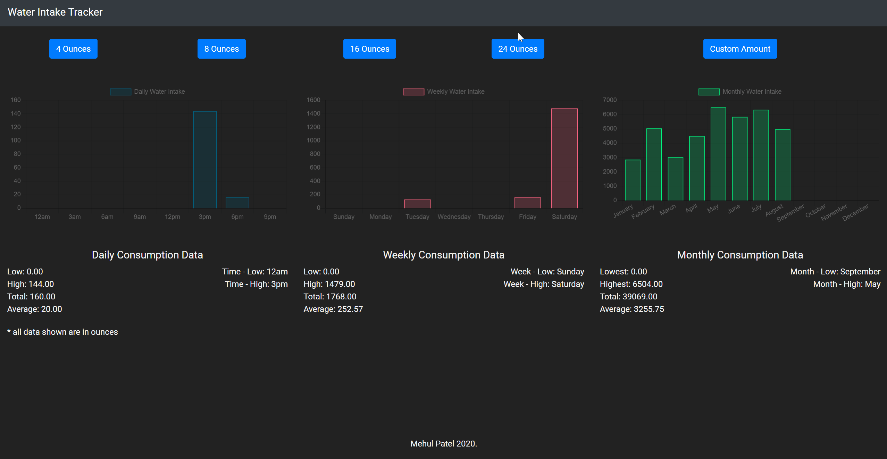

# Water Intake Tracker

This project displays a graph of a person's water intake for the daily, weekly, and monthly time periods, as well as useful information such as their maxiumum and minimum intake. This project is built using ExpressJS for the backend, and ReactJS for the frontend.

To run the project, first install the dependencies by running **npm install**, and then by running **npm run dev**

What **npm run dev** will do is run the backend and frontend concurrently, that way the frontend is able to fetch the data stored in *data.txt* in the backend folder. *data.txt* is where the data for the water intake tracker is stored.

This will use PORT 3000 for the react app and PORT 5000 for the backend. If there were no issues with the installation and running the webapp, visiting http://localhost:3000, you will be able to interact with the water intake app.
